# Описание
Реализация клиента базы данных на примере системы "Отель"
## Таблицы (Access)
- Гостиничный номер (Счетчик номера, Название номера, Тип номера, Количество мест, Цена)
- Постоялец (Счетчик постояльца, Счетчик номера, Фамилия, Имя, Отчество, Серия паспорта, № паспорта, Дата заселения, Дата выселения)

## Функции системы
- Добавить новый гостиничный номер
- Изменить сведения о гостиничном номере
- Удалить гостиничный номер
- Заселить нового постояльца
- Изменить сведения о постояльце
- Удалить сведения о постояльце

## Инструкция по эксплуатации программы
-Внешний вид программы при запуске    
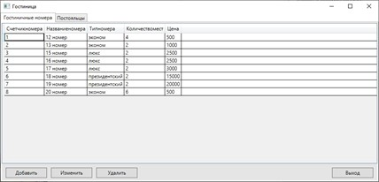    

Для навигации между таблицами данных используйте вкладки с названиями таблиц    
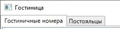    

- Добавление гостиничного номера
Для добавления Гостиничного номера нажимаем «Добавить», после открывается вкладка, на которой заполняем данные. Нажимаем «Добавить».    
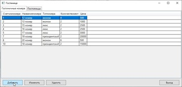    
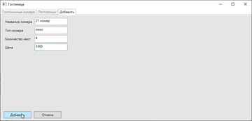    
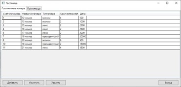    

- Изменение информации о гостиничном номере
Для редактирования данных необходимо выбрать номер, который требуется изменить. Нажимаем кнопку «Изменить».    
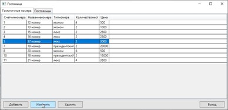    
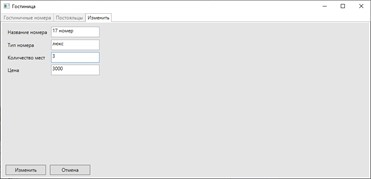    
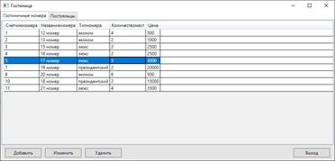    

- Удаление гостиничного номера
Для удаления гостиничного номера из БД нужно выбрать из списка номер, который необходимо удалить. Нажимаем на кнопку «Удалить», и подтверждаем удаление.    
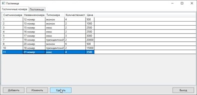    
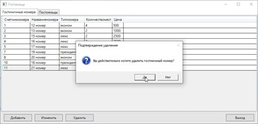    

Для того чтобы просмотреть/редактировать постояльцев, выберите вкладку «Постояльцы».    
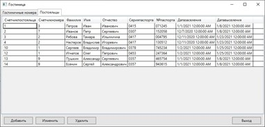    
